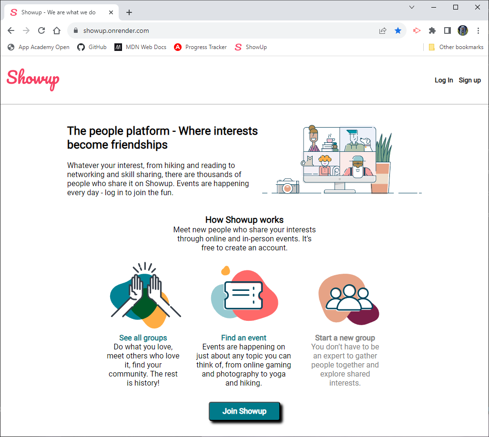
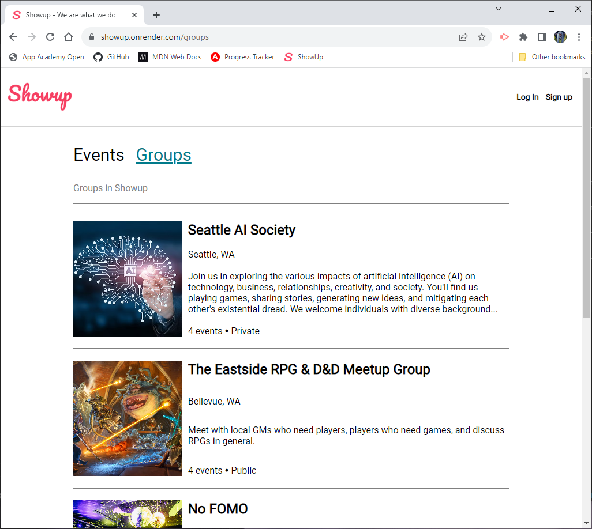
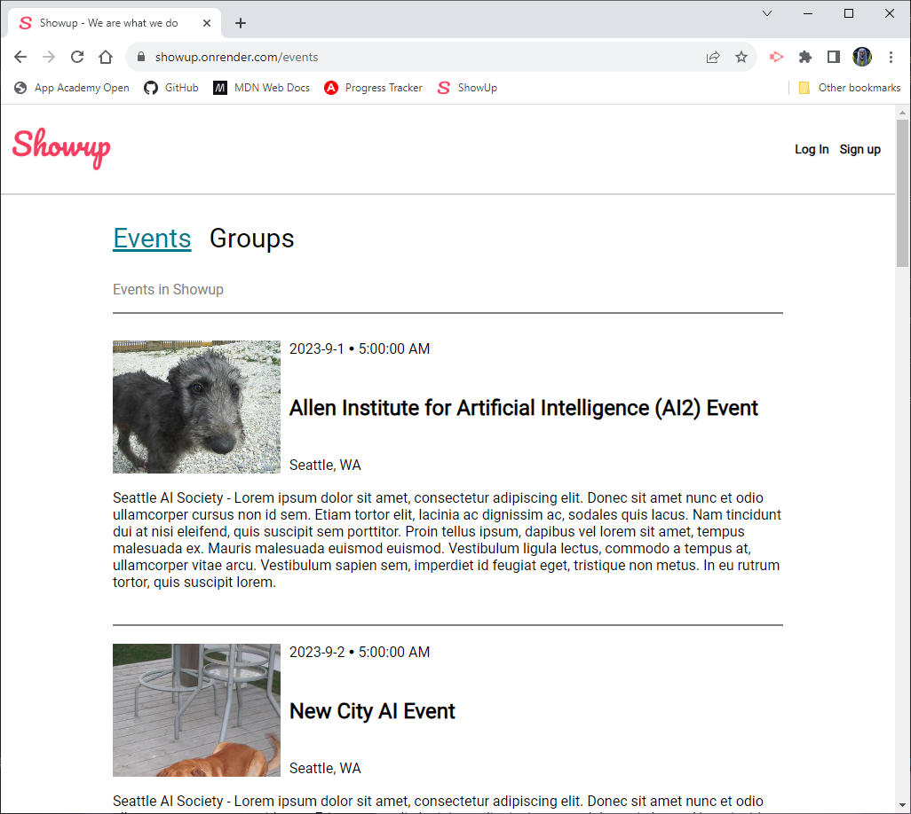

# Show Up

## Description
This is a clone of the Meetup website the front end of the site was written in React.

## Table of Contents
- [Technologies](#technologies)
- [Installation](#installation)
- [Usage](#usage)
- [Credits](#credits)

## Technologies
Backend Dependencies:
- bcryptjs
- cookie-parser
- cors
- csurf
- dotenv
- express
- express-async-errors
- express-validator
- helmet
- jsonwebtoken
- morgan
- per-env
- pg
- sequelize
- sequelize-cli

Backend Dev Dependencies:
- dotenv-cli
- nodemon
- sqlite3

Frontend Dependencies:
- @testing-library/jest-dom
- @testing-library/react
- @testing-library/user-event
- js-cookie
- react
- react-dom
- react-redux
- react-router-dom
- react-scripts
- redux
- redux-thunk

## Installation

Backend:
1. Change directory to the "backend" folder.
    - ```cd/backend```
2. Install the dependencies by running the following command:
    - ```npm install```
3. In the backend folder create a ```.env``` file.
4. Copy the contents of the ```.env.example``` file to the ```.env``` file.
5. Replace ```«secret»``` with a secret of your own.
6. Run the following commands, wait for the first to complete before running the second.
    - ```npx dotenv sequelize db:migrate```
    - ```npx dotenv sequelize db:seed:all```
7. Now run the command to start the server:
    - ```npm start```

Frontend:
1. Change directory to the "frontend" folder.
    - ```cd/frontend```
2. Install the dependencies by running the following command:
    - ```npm install```
3. Now run the command to start the server:
    - ```npm start```
4. If a browser window doesn't open automatically you can open your own browser and navigate to:
    - [http://localhost:3000/](http://localhost:3000/)

## Usage
Link - [https://showup.onrender.com/](https://showup.onrender.com/)





## Credits
Zach Smith - [GitHub Profile](https://github.com/Lemelisk271)
